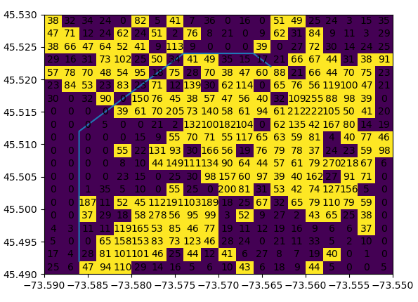

# Montreal crime analysis

This app finds the shortest path using the A* algorithm between two points on a map based on crime data for the Montreal region. Each region, depending on threshold percentage supplied, will draw a set of yellow squares where the amount of crime in that area exceeds a representative threshold value (calculated with the supplied threshold percent in the textbox). Each square size is determined by the supplied edge width (also supplied via a textbox). A particular square (cell) can only be traversed diagonally if it is *not\* a high crime cell (i.e. is not black). A path edge is only possible if one of the two adjacent cells involved is not yellow.

The path costs are explained below:

- 1.0 for each orthogonal single step vertex to vertex movements between two non high crime cells
- 1.3 for each orthogonal single step vertex to vertex movements between one high crime cell and one non high crime cell
- 1.5 for each diagonal single step vertex to vertex movements across non high crime cells

The heuristic uses the path cost information to estimate the cost from any vertex to a goal vertex as follows:

`h(n) = 1.5 * min(|di|, |dj|) + 1.0 * (max(|di|, |dj|) - min(|di|, |dj|))`

where `|di| = abs(node_current.i - node_goal.i)` and `|dj| = abs(node_current.j - node_goal.j)`

This ensures that the heuristic estimate is based on being able to go diagonal to the goal node in the most steps possible each at 1.5 cost, whereas any remaining orthogonal movements are performed with an assumed cost of 1.0 (representing the lowest cost scenario to avoid any overestimates).

Install the necessary dependencies:

Geopands
matplotlib
numpy

Instruction to run the program:

1. Navigate to the folder where 'py A1.py' belongs to
1. Type 'py A1.py' in the command line
2. You will be prompt to enter the gridsize and the threshold
3. Enter gridsize and threshold seprated by a comma (e.g 0.002,50)
4. A grid will be generated
5. To see the grid with crime rates close the current grid
6. To enter a path, close the current grid
7. You will be prompt to enter start and goal longitude and latitude
8. Enter the start longitude and latitude closest to atleast 3 decimal places seprated with a comma(e.g -73.5613,45.503)
9. Enter the goal longitude and latitude (e.g. -73.5527,45.4938)
10. A graph will be generated with an optimal path from start to goal

Test cases to copy and paste:

grid&threshold: 0.002,50
start: -73.5613,45.503
end: -73.5527,45.4938

grid&threshold: 0.003,40
start: -73.5535, 45.5274
end: -73.5848, 45.5156

grid&threshold: 0.004,80
start: -73.5535, 45.5274
end: -73.5848, 45.5156

grid&threshold: 0.004,80
start: -73.589,45.531
end: -73.54,45.496

grid&threshold: 0.002,50
start:-73.5772,45.5052
end:-73.571,45.5032

grid&threshold: 0.002,90
start: -73.589,45.531
end: -73.549,45.531

grid&threshold:0.002,90
start:-73.5894,45.4902
end:-73.5871,45.4914

grid&threshold:0.002,50
start:-73.5633,45.5227
end:-73.5849,45.4926
